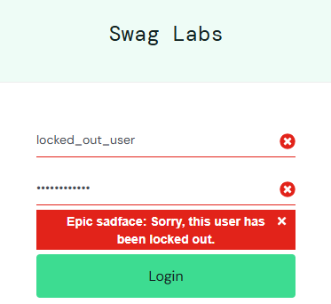
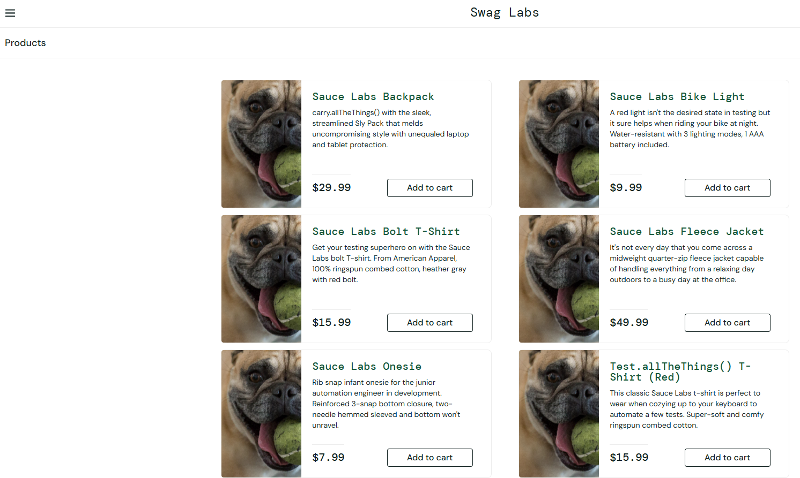
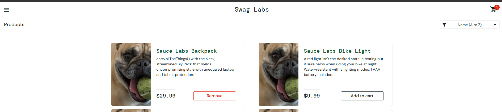

# SauceDemo Bug Report

**Bug ID:** BUG-001  
**Title:** [Login] Locked-out user cannot access account  

**Description:**  
Error message is displayed for locked-out users, but could include instructions to resolve the issue.

**Steps to Reproduce:**  
1. Open `https://www.saucedemo.com/`  
2. Enter username: `locked_out_user`  
3. Enter password: `secret_sauce`  
4. Click **Login**  

**Expected Result:**  
Clear instructions for account resolution should appear.

**Actual Result:**  
Error message: *“Sorry, this user has been locked out.”*  

**Severity:** Minor  
**Priority:** Medium  
**Environment:** Chrome 115, Windows 11  

**Attachments:**  

------------------------------------------------------------------

**Bug ID:** BUG-002  
**Title:** [Product List] problem_user incorrect images of products

**Description:**  
The images of the products do not correspond to the product details.

**Steps to Reproduce:**  
1. Open `https://www.saucedemo.com/`  
2. Enter username: `problem_user`  
3. Enter password: `secret_sauce`  
4. Click **Login** 
5. View the Product Page 

**Expected Result:**  
The respective images should appear for each product.

**Actual Result:**  
All the pictures appear to be a specific image of a dog. 

**Severity:** Medium  
**Priority:** Medium  
**Environment:** Chrome 115, Windows 11  

**Attachments:**  

------------------------------------------------------------------

**Bug ID:** BUG-003  
**Title:** [Add To Cart] problem_user cannot add specific products

**Description:**  
When user attempts to add either of the 2 products "Sauce Labs Bolt T-Shirt" and/or "Sauce Labs Fleece Jacket" the cart does not refresh its state to add them.

**Steps to Reproduce:**  
1. Open `https://www.saucedemo.com/`  
2. Enter username: `problem_user`  
3. Enter password: `secret_sauce`  
4. Click **Login** 
5. In the Product Page click 'Add to cart' for the "Sauce Labs Bolt T-Shirt" and/or "Sauce Labs Fleece Jacket"

**Expected Result:**  
The products should be added in the cart.

**Actual Result:**  
Nothing changes when the button 'Add to cart' is pressed 

**Severity:** Medium  
**Priority:** High  
**Environment:** Chrome 115, Windows 11  

------------------------------------------------------------------

**Bug ID:** BUG-004  
**Title:** [Remove From Cart] problem_user cannot remove products from the cart

**Description:**  
The user is unable to remove products from the cart with the 'Remove' button being in the Product List page 

**Steps to Reproduce:**  
1. Open `https://www.saucedemo.com/`  
2. Enter username: `problem_user`  
3. Enter password: `secret_sauce`  
4. Click **Login** 
5. In the Product Page click 'Add to cart' for the "Sauce Labs Backpack"
6. Try to press the "Remove" button under the "Sauce Labs Backpack" product

**Expected Result:**  
The product should be removed from the cart.

**Actual Result:**  
Nothing changes when the button 'Remove' is pressed 

**Severity:** Medium  
**Priority:** High  
**Environment:** Chrome 115, Windows 11

**Attachments:**  

 
